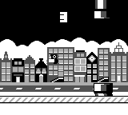

# travelbird-game-boy
Travelbird themed Flappy Bird clone for Game Boy

## What is this?

Back in 2017 I created a Game Boy game during a hackathon at Travelbird. It's a Flappy Bird clone, but themed for the company. There is some [footage](https://www.youtube.com/watch?v=CX-8I869lsA) of the game (without sound unfortunately), recorded from an emulator.




I recently found the source code and image assets, created by Paul Verhulst by the way, and decided to share this for posterity. I can still be compiled on MacOS Tahoe in 2026 using [gbdk-2020](https://github.com/gbdk-2020/gbdk-2020) and [png2gb](https://github.com/LuckyLights/png2gb)!

The resulting rom is available in the [Releases section](https://github.com/optroodt/travelbird-game-boy/releases) if you don't want to build it yourself.

## Requirements for compiling

You will need [gbdk-2020](https://github.com/gbdk-2020/gbdk-2020) and [png2gb](https://github.com/LuckyLights/png2gb).

### gbdk-2020
Download the latest gbdk-2020 release for your operating system from the [releases page](https://github.com/gbdk-2020/gbdk-2020/releases) and extract it somewhere.

### png2gb
You will need to compile this utility yourself. On MacOS, make sure you have the Xcode Command Line Tools installed:
```bash
xcode-select --install
```

Then clone the [repository](https://github.com/LuckyLights/png2gb) and run
```bash
make all
```

I changed the `Makefile` to  use `/usr/bin/clang++` as the C compiler.

### set paths
Copy the `.env.sample` file to `.env` and modify it so that it has the correct paths to `gbdk-2020` and `png2gb`.
```bash
export PNG2GB=/path/to/png2gb-binary
export GBDK_HOME=/path/to/gbdk-home
```
## How to compile

Run
```
source .env
make all
```

This should now put a `travelbird.gb` rom in the root of this project. You *can* run this on real Game Boy hardware.
